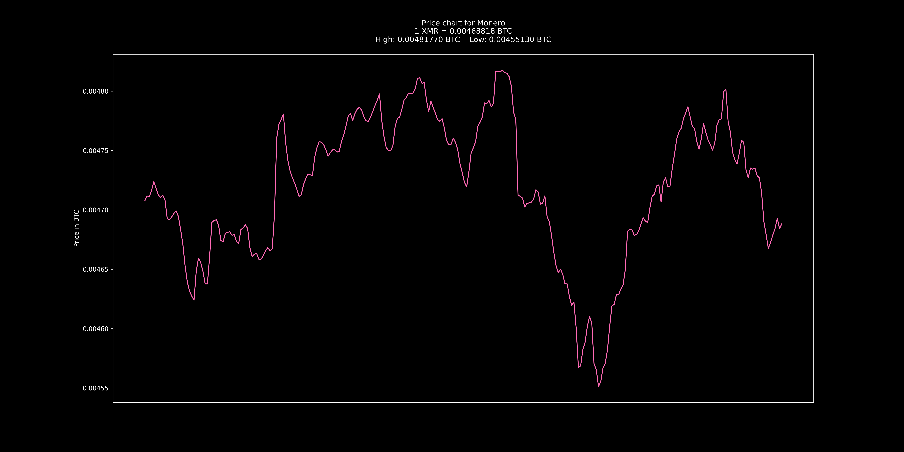

# Crypto Wallpaper

- [Crypto Wallpaper](#crypto-wallpaper)
  - [Info](#info)
  - [Installation](#installation)
  - [Config](#config)
  - [Notes for Linux users](#notes-for-linux-users)
  - [Colors](#colors)

## Info
A fairly simple Python script that uses the [CoinGecko API](https://www.coingecko.com/en/api) to replace your desktop wallpaper with a price chart of your favorite cryptocurrency. The script is also extremely easy to modify to your needs, feel free to do so! If you have any problems, feel free to send me a Reddit DM or open an issue (or open a pull request if you can fix it yourself)!

If you want to donate:

BTC - `bc1qlxx5kqec6ly669lnpkl6nfq6xrvrrmakzmnlrd`

ETH - `0x4032c5AE16C49b5C9A1756c9D98Ef560Fa559ae3`

XMR - `85xwVYAVSrnXACsFbf5Gzs9vLLeVux2AyNXiHh8J77UHctb55j9aYwQ9ESfm9ispnDWDChD4op3RgBb62u8devwyB8csvTG`

<h2>Images</h2>

 

## Installation
1. Python is required, if you don't already have it installed, download and install it from [here](https://www.python.org/downloads/).
2. Clone this project by running `git clone https://github.com/alternett/crypto-wallpaper`
3. Install the required packages by running `py -m pip install -r requirements.txt`
   
   * If `py` is not recognized as a command try replacing it with either `python` or `python3`, or add it to you PATH.
   
   * Some people may have some issues with matplotlib, try installing it by running `py -m pip install matplotlib` separately.

4. Modify the [config](#config) to your needs.
5. Run the program with `py main.py`

## Config
Setting          | Description
-----------------|------------
coin             | The ID of the coin you want to display. [I made a website where you can look up the ID if you're unsure.](https://alternett.github.io/coins)
currency         | The currency you want to use. [I made a website where you can look up all supported currencies.](https://alternett.github.io/currencies)
timespan         | The timespan of the graph, measured in hours. Write 0 or "max" to show an all-time graph.
refresh_interval | How often it will request info from the API (in seconds). PS: CoinGecko only update their data every few minutes, that's why you may not notice changes by lowering this.
color            | The color of the graph. You can see all colors [here](https://matplotlib.org/stable/gallery/color/named_colors.html) or by [scrolling down](#colors). You can also use hex codes for the colors (`#ff9900`).
dark_theme       | Toggles between dark theme (true) or light theme (false).
figsize          | [The size of the image in inches](https://matplotlib.org/3.1.1/api/_as_gen/matplotlib.pyplot.figure.html). Change the values according to your display size. In the format: [width, height]. You may need to experiment a bit with this.
dpi              | Dots per inch; higher DPI = higher resolution, but also higher resource use when generating the background image.
background_cmd   | If you're on Windows you can ignore this. If you're on Linux, this is the command that will change your background, scroll down to [notes for Linux users](#notes-for-linux-users) for more info.

## Notes for Linux users
Since there are so many different ways to change the wallpaper in Linux depending on so many different factors, you'll probably get an error if you try to run the program as is. To fix this, use the internet to find how to change your wallpaper using the command line. Copy the command into the config and replace the path of the image in the command with `PIC`. 

For example:

In Gnome you change your wallpaper using the command `gsettings set org.gnome.desktop.background picture-uri /path/to/image.png`, so if you're a Gnome user the setting `background_cmd` should be `gsettings set org.gnme.desktop.background picture-uri PIC`.

## Colors
Matplotlib supports hex values, but also these named colors:
